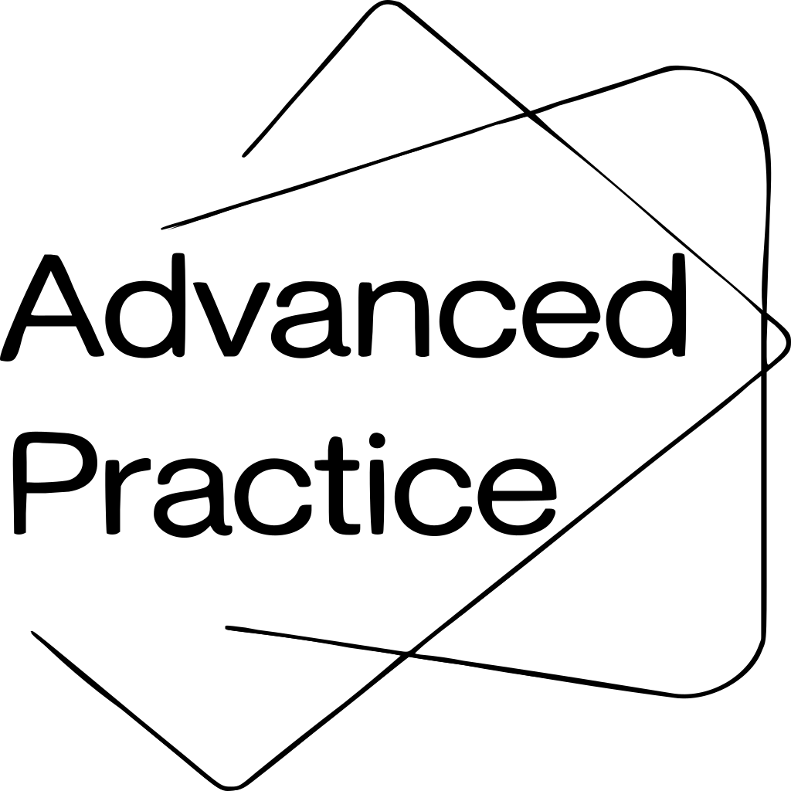

# 🧠 Advanced Practice Learning Platform

<div align="center">
  

  
  
  
  
  [Launch Platform](https://app.advancedpractice.io) • [Documentation](https://docs.advancedpractice.io)
</div>

## 📚 Overview

Advanced Practice is a comprehensive learning platform designed specifically for psychopharmacology education. Our platform serves as a bridge between academic research and clinical practice, providing high-quality educational content for students, healthcare providers, and professors in the field of psychopharmacology.

### 🎯 Target Audience
- Medical Students
- Psychiatry Residents
- Practicing Psychiatrists
- Nurse Practitioners
- Clinical Pharmacists
- Psychiatric Researchers
- Medical Educators

## ✨ Key Features

### 🎓 Educational Content
- **Interactive Courses**: Structured learning paths with multimedia content
- **Clinical Case Studies**: Real-world applications and decision-making scenarios
- **Research Updates**: Latest developments in psychopharmacology
- **Assessment Tools**: Self-evaluation and progress tracking

### 👥 Collaboration Tools
- **Discussion Forums**: Peer-to-peer learning and knowledge sharing
- **Expert Sessions**: Live webinars with field experts
- **Study Groups**: Collaborative learning environments
- **Resource Sharing**: Academic papers, clinical guidelines, and protocols

### 📊 Analytics & Progress Tracking
- **Learning Analytics**: Detailed progress monitoring
- **Performance Metrics**: Comprehensive assessment results
- **Certification Tracking**: CME/CEU credit management
- **Personalized Learning Paths**: AI-driven content recommendations

## 🛠️ Technical Stack

### Frontend
- Next.js
- TypeScript
- TailwindCSS
- GraphQL Client
- NextAuth.js
- Yarn

### Backend
- Django
- Django-allauth
- GraphQL (Graphene)
- MinIO
- PostgreSQL
- Redis

### Development Tools
- Conda (Python 3.12+)
- NVM (Node 20+)
- Prisma
- Docker
- Kubernetes

### Infrastructure
- AWS
- CI/CD with GitHub Actions
- MinIO Object Storage
- Redis Cache
- PostgreSQL Database

## 🚀 Getting Started

### Prerequisites
```bash
# Python environment
conda create -n advancedpractice python=3.12
conda activate advancedpractice

# Node.js environment
nvm install 20
nvm use 20

# Package managers
pip install -r requirements.txt
yarn install

# Docker
docker >= 20.10.0
```

### Installation
1. Clone the repository
```bash
git clone https://github.com/DripTrace/advanced-practice/platform.git
cd platform
```

2. Set up environment variables
```bash
cp .env.example .env
```

3. Start development servers
```bash
# Backend
python manage.py migrate
python manage.py runserver

# Frontend
yarn dev
```

## 📖 Documentation

Detailed documentation is available at [docs.advancedpractice.io](https://docs.advancedpractice.io):
- [API Documentation](https://docs.advancedpractice.io/api)
- [Development Guide](https://docs.advancedpractice.io/development)
- [Deployment Guide](https://docs.advancedpractice.io/deployment)
- [Contributing Guidelines](https://docs.advancedpractice.io/contributing)

## 🤝 Contributing

We welcome contributions from the community! Please read our [Contributing Guidelines](CONTRIBUTING.md) before submitting pull requests.

### Development Process
1. Fork the repository
2. Create a feature branch
3. Commit changes
4. Push to the branch
5. Open a Pull Request

## 📄 License

This project is licensed under the MIT License - see the [LICENSE](LICENSE) file for details.

## 🔒 Security

For security issues, please email security@advancedpractice.io

## 📞 Support

- Documentation: [docs.advancedpractice.io](https://docs.advancedpractice.io)
- Email: support@advancedpractice.io
- Discord: [Join our community](https://discord.gg/advancedpractice)

## 🌟 Acknowledgments

Special thanks to:
- Our contributing educators and clinicians
- Open source community
- Research institutions and partners

---

<div align="center">
  <h3>💫 Made with passion for advancing psychopharmacology education 💫</h3>
  
  [Website](https://advancedpractice.io) • 
  [Platform](https://app.advancedpractice.io) • 
  [Blog](https://blog.advancedpractice.io) • 
  [Twitter](https://twitter.com/advancedpractice) •
  [Instagram](https://www.instagram.com/advancedpractice/) •
  [YouTube](https://www.youtube.com/@AdvanCEdpractice-io/videos) •
  [Threads](https://www.threads.net/@advancedpractice?xmt=AQGzzHuKVatfdGjTtcO2Jp_5p_qIytfEhQ35oVpekGNEpdg)

  <div class="social-icons">
    <!-- <a href="https://twitter.com/advancedpractice" target="_blank">
      
    </a> -->
    <a href="https://www.instagram.com/advancedpractice/" target="_blank">
      
    </a>
    <a href="https://www.threads.net/@advancedpractice?xmt=AQGzzHuKVatfdGjTtcO2Jp_5p_qIytfEhQ35oVpekGNEpdg" target="_blank">
      
    </a>
    <a href="https://www.youtube.com/@AdvanCEdpractice-io/videos" target="_blank">
      
    </a>
  </div>
</div>
